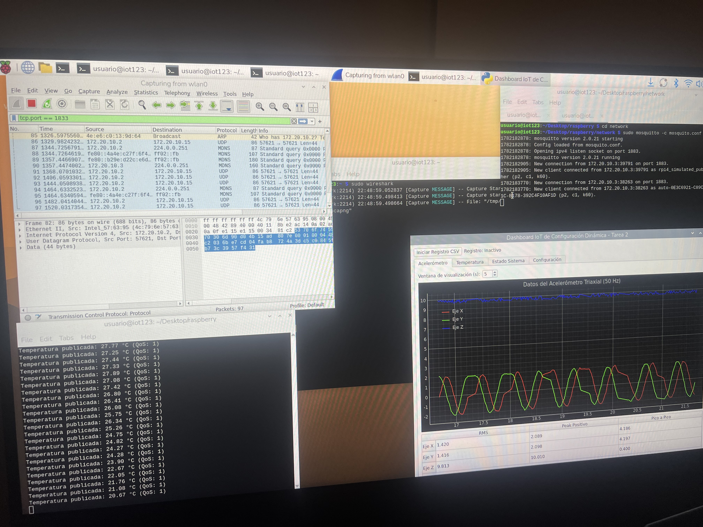

# tarea 2

Integrantes: Paula Fernández, Juan Pablo Sánchez

El sistema actual consta de dos dispositivos individuales, una raspberry Pi 3 y un esp32, dentro de la raspberry tenemos la interfaz gráfica para los sensores de temperatura y aceleración, además de un broker mqtt y finalmente el publisher que genera los datos.

## Instalación

Se necesita instalar DHCP y Mosquitto

`sudo apt install mosquitto`

`sudo apt install dhcp`

Version: nanopb-0.4.8

Comandos para generar protobuf:

`protoc --python_out=raspberry proto/sensors.proto`

`protoc -opacket.sensors.pb proto/sensors.proto`

`nanopb_generator packet.sensors.pb`

## Configuración servidor

Lo primero es iniciar el servidor desde la raspberry ejecutando los siguientes comandos en distintas terminales

`sudo ip address add 192.168.10.1 dev wlan0`

`sudo hostapd hostapd.conf`

`sudo dnsmasq -C dnsmasq.conf -d`

`sudo mosquitto -c mosquito.conf`

## Publisher y GUI

Para ambas aplicaciones necesitamos tener python, crear un ambiente virtual e instalar en el las librerias de requirements.txt con `pip install -r requirements.txt`

Luego de esto en dos terminales distintas con el ambiente activo correr los comandos

`python3 publisher.py`
`python3 gui.py`

## Wifi

Por defecto dentro de config.json el programa usa la red wifi creada con los comandos utilizados, para su uso dentro de este mismo archivo y la variable wifi ssid y  wifi pass de main.c en esp32-sub

## Esp32

Primero correr el comando para activar el entorno esp idf.

Luego dentro de la carpeta esp32-sub correr 
`idf.py flash monitor`

## Funcionamiento

<figure>
  
</figure>

Aqui se puede ver una raspberry 3 peleando por su vida para enseñar todos los procesos
